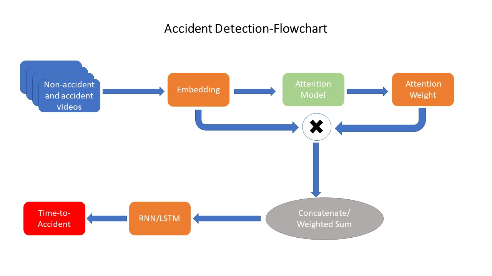

# Accident Detection
The initial model is described in "Anticipating Accidents in Dashcam Videos".

### Introduction

The main goal is the recognition o the pre-accident stage in order to provide the system with the ability to react.The under-development model
could forecast an accident. The purpose is to do this task as many seconds as possible before the accident occurs.

### Pre-requisites

##### Tensorflow 
##### Opencv
##### Matplotlib
##### Numpy

### Flowchart



### Dataset & Features

In the first phase, 1750 clips, where each clip consists of 100 frames (5 seconds) are used 
for training and testing. These clips contain 620 positive clips containing the
moment of accident at the last 10 frames, and 1130 negative clips containing
no accidents. The split of the dataset into training and testing was done randomly.

Dataset : http://aliensunmin.github.io/project/dashcam/ .
Download the file and put it in "datatset/videos" folder.

CNN features : https://drive.google.com/file/d/0B8xi2Pbo0n2gRGpzWUEzRTU2WUk/view .
Download the file and put it in "dataset/features" folder.

Annotation : https://drive.google.com/file/d/0B8xi2Pbo0n2gdTlwT2NXdS1NTFE/view .
Download the file and put it in the project's folder.

The implementation will be completed and tested 
on the data that will be given by SHOW’s data providers
### Usage

#### Run Demo
```
python3 accident.py --model ./demo_model/demo_model
```

#### Training
```
python3 accident.py --mode train --gpu gpu_id
```

#### Testing
```
python3 accident.py --mode test --model model_path --gpu gpu_id
```

### Citing

Under development.

### Contact
alexpap@iti.gr
