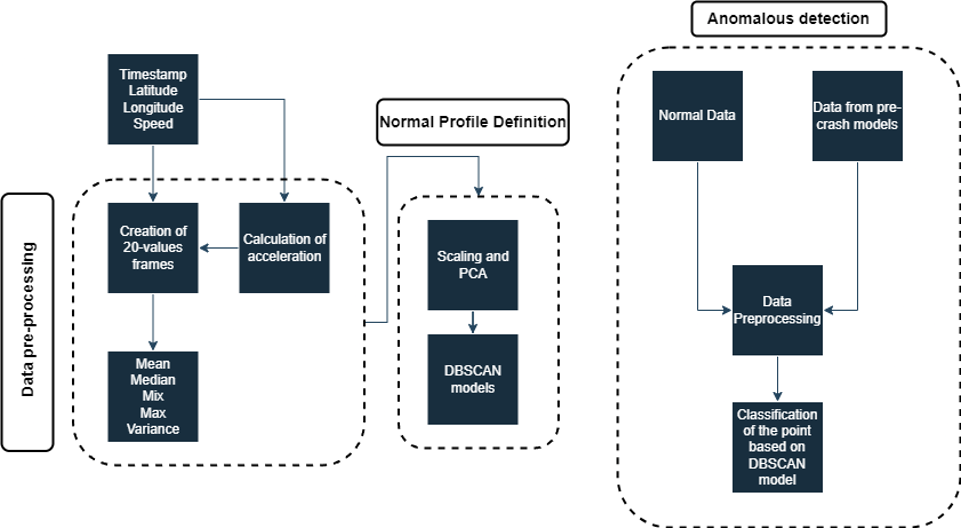

# Accident Detection
Autonomous Vehicles (AVs) will be the future of automotive including both the Public and the Private Transportation. One of the major concerns of the corresponding research community is the safety of the AVs. Considering this, a lightweight accident detection model for autonomous fleets is presented, utilizing only GPS data. The proposed accident detection model combines well-known statistical and machine learning techniques such as data normalization, PCA transformation, and DBSCAN clustering. In order to validate the proposed methodology simulated data were utilized exploiting well-established techniques, such as Dead-Reckoning, accident speed profiles, and pre-crash acceleration models. The preliminary results highlighted that the proposed methodology managed to achieve its accurate accident detection purpose presenting accuracy higher than 98\%.

### Introduction

The suggested model is founded upon GPS data which serves to establish the standard operation of AVs. However, in order to validate the model, data pertaining to accident scenarios is required, yet is currently unavailable. Additionally, there is a lack of models and theoretical foundations explicating the velocity and acceleration patterns of AVs to enable the detection of anomalies that could potentially lead to accidents. To address this issue, simulated accidents inheriting the consideration of conventional vehicles' accidents are injected for the methodology validation. The definition of the normal operation is established via the usage of the Density-Based Spatial Clustering of Applications with Noise (DBSCAN) clustering that receives as input  GPS data being processed by Principal Component Analysis (PCA) toward dimensionality reduction. After that, accident scenario tools are employed and by inspecting these abnormal data outside from the normal operation cluster, the detection of such events is performed.

### Pre-requisites

##### Tensorflow 1.14
##### Opencv
##### Matplotlib
##### Numpy

### Flowchart



### Dataset 
The data used are sourced by an operating SHOW project site. Samples of them are available in Zenodo.

### Usage

#### Data Generator
```
python3 data_generator
```

#### Training & Testing
```
python3 full_accident_detection.py
```


### Citing

Papadopoulos, A., Sersemis, A., Spanos, G., Lalas, A., Liaskos, C., Votis, K., & Tzovaras, D. (2024). Lightweight accident detection model for autonomous fleets based on GPS data. Transportation research procedia, 78, 16-23.

### Contact
Alexandros Papadopoulos. alexpap@iti.gr
