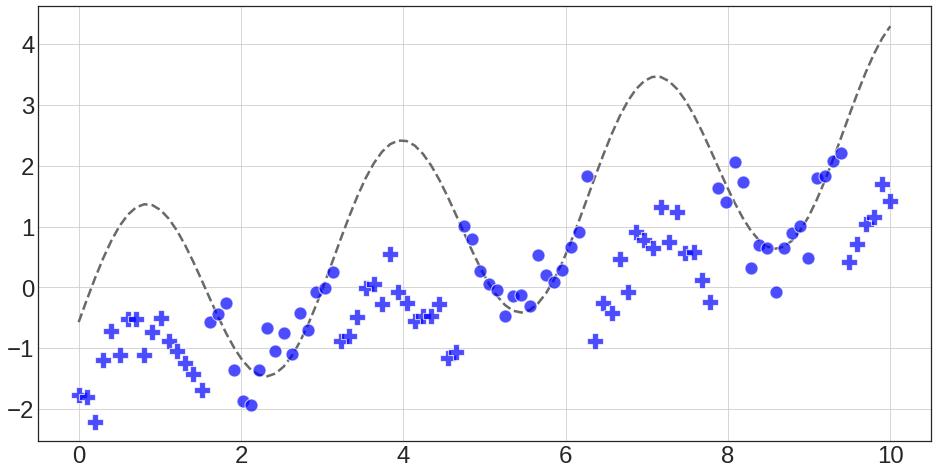
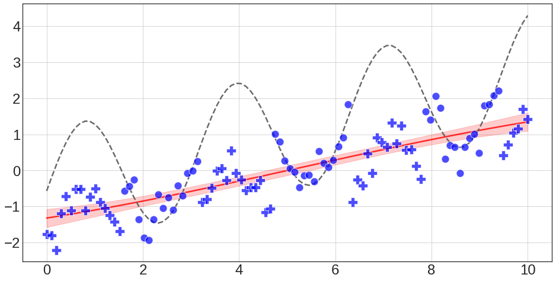
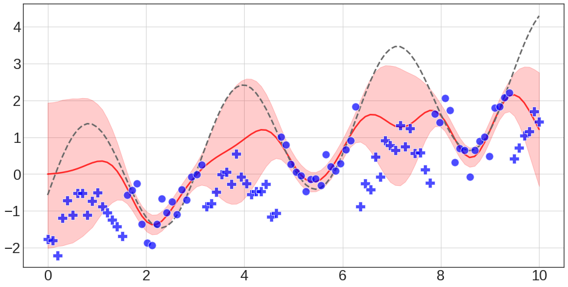
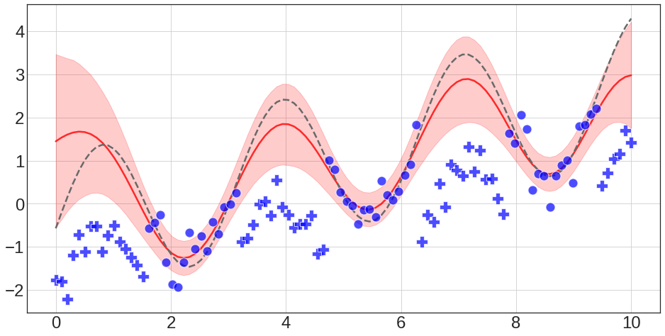
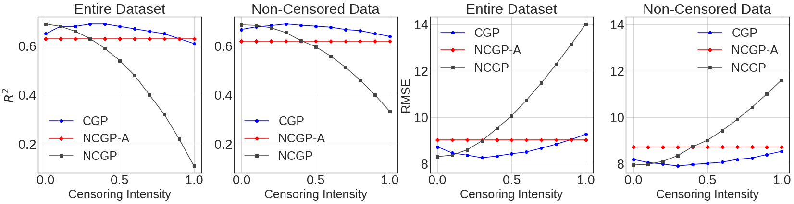
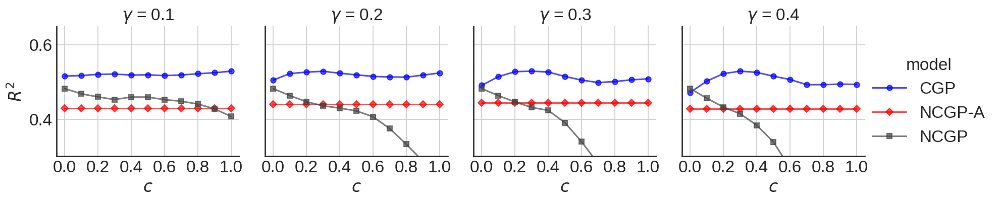

# Censored Gaussian Processes
---------------------------------------------------------------

This repository is the official implementation of the CGP, from *Estimating latent demand of shared mobility through censored Gaussian Processes*.

The full paper is available here: [link1](https://arxiv.org/abs/2001.07402), [link2](https://www.sciencedirect.com/science/article/pii/S0968090X20306859?via%3Dihub)

| | |
|:-------------------------:|:-------------------------:|
| |  |
|  |  |

The implementation is based on [GPy](https://github.com/SheffieldML/GPy)

## Summary

This repository contains:

1. `GPy/likelihoods/censored_gaussian.py`: the proposed Censored-Gaussian distribution together with the respective moments for the EP inference procedure (Section 3.4 in the paper)
2. `GPy/models/gp_censored_regression.py`: the proposed CGP model


Using the Censored GP in your own GPy code for regression problems is very simple. For example, given (i) a censored dataset {`x`, `y_censored`}, (ii) a kernel function (`kernel`) and (iii) censorship labels (`censoring`), you just need to instatiate a `GPCensoredRegression` model (as you would normally do with GPy objects, e.g. `GPRegression` in the standard GP with homescedastic noise):

```python
kernel = GPy.kern.RBF(input_dim=1, variance=1., lengthscale=1.) # kernel function
censoring = ... # censorship labels (i.e. vector having c_i=1 if observation "i" is censored and c_i=0 otherwise)
likelihood = GPy.likelihoods.CensoredGaussian(censoring=censoring, variance=1.) # censored-Gaussian likelihood

# build model
gp = GPy.models.GPCensoredRegression(X=x, Y=y_censored, censoring=censoring, kernel=kernel, likelihood=likelihood) # CGP model

# optimize model
gp.optimize(optimizer="adam", max_iters=2500, messages=True)
```

Once the model is trained, you can obtain posterior samples and use it to make predictions:
```python
f_samples = gp.posterior_samples_f(X=x, size=100) # get 100 posterior samples for the input x 
```

## Training and Evaluation code

A working Jupyter Notebook is provided in `CensoredGP_Intro.ipynb`, replicating results for the synthetic dataset (more details in Section 4 of the paper).

The notebook contains:

1. Data Generation & Pre-processing
2. Training & Evaluation code for the synthetic dataset showcasing usage of the three models used in our experiments (i.e. NCGP, NCGP-A, CGP)

## Summary of results

In our work, we show how the proposed model is able to achieve better performance in capturing the latent non-censored process on a variety of different tasks. Below is a summary of the presented results:

</td> <br />
</td> <br />

#### Acknowledgements

This code base builds on several other repositories. The biggest sources of inspiration are:

* https://github.com/SheffieldML/GPy
* https://github.com/BRML/climin

Thanks to the authors of these and the many other useful repositories!
